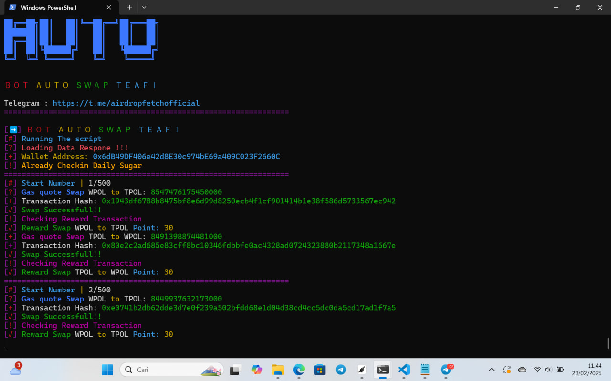

# teafi-auto-bot


## Preparation before starting
- **Permit Sign manual / swap WPOL to TPOL 1x manual on web before run script**
  
- **Balance POL min 1**

- **Balance WPOL min 2**


## Installation 
1. Clone the repository:
```bash
git clone https://github.com/taikoyaki/TeaFi-auto-Bot.git
```
2. Open File
```bash
cd TeaFi-auto-Bot
```
3. Install Module
```bash
npm install
```
4. Change file **config.json** edit text number **"ITERATIONS": 500,** to confirm total swap
example:   **"ITERATIONS": 200,** so total swap 200x swapped

5. set your private key on file **.env**

6. Run the bot
```bash
node bot.js
```


Last updated: Sat Jun 21 18:22:45 UTC 2025
